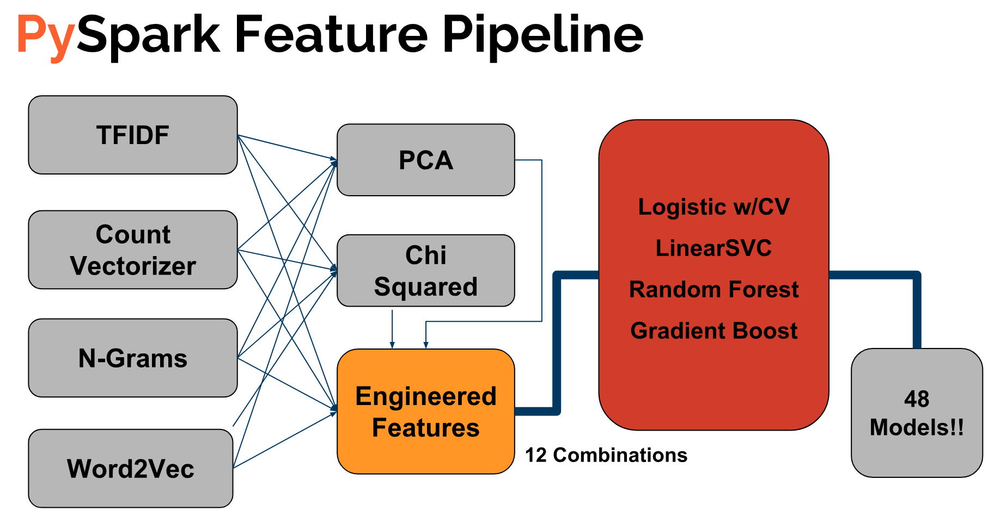

# Classifying Amazon Reviews: Helpful or Not?

## Motivation

Have you ever been looking for an item on Amazon that wasn’t particular popular and noticed that none of the reviews are tagged helpful? This project builds a model to classify whether a review is “helpful” in order to prioritize “helpful” untagged reviews.

## Data

I used [UCSD's Julian Mcauley's Amazon Review dataset](http://jmcauley.ucsd.edu/data/amazon/links.html) which is split up into subcategories of reviews and is a total of about 35G of data.

## Technology - AWS (Amazon Web Services) + Apache Spark

Big data is something I was missing from my data analytics background so I decided to develop and run everything on AWS on an Apache Spark cluster using AWS EMR (Elastic MapReduce). For context, EMR is a service that allows the building of clusters of servers to accelerate Map-Reduce jobs through distributed database queries and analysis.

I stored all my data on an AWS S3 storage bucket, connected it to a master AWS EMR (Elastic MapReduce) instance with 1 master node and 14 core nodes. This allowed me to use Spark to parallelize all execution across 14 computers each with 8 CPUs and 15G of memory.

## Model

Since I was using Apache Spark to run everything on an EMR instance, I decided to max out on the number of feature pipeline and model combinations I could to pick the best model to classify helpful Amazon reviews.

### Feature Pipeline

#### Step 1: Featurize Review Text
The first step in doing anything NLP related is featurizing your text, or in other words, turning your text into numeric representations to run machine learning models on. I did this by choosing 4 different methods to featurize text.

- **Count Vectorizer -** Representation of text where you count word frequencies. It weighs words that appear more times in your entire corpus (bag of words) higher.
- **TF-IDF (Term Frequency - Inverse Document Frequency)-** Similar to Count Vectorizer but instead of increasing the weight of term frequency in your entire corpus, it puts more importance on words that appear more per document.
- **N-Grams (Only used Unigrams + Bigrams) -** This numeric representation puts more importance on single word and 2-word phrases that appear more frequently in the entire corpus.
- **Word2Vec -** SparkML uses a pretrained mapping of words to numeric values based on [Google's trained word mapping](https://code.google.com/archive/p/word2vec/). This maps "similar" words, or synonyms to numbers that are closer together. It also takes into account skipgrams, which means it also maps words that are more probable to appear next to each other to closer numeric values.

#### Step 2: Feature Reduction
In my feature pipeline, I included the option to reduce the corpus by one of the following two methods.

- **PCA (Principal Component Analysis) -** Using PySpark's PCA module, this method attempts to reduce the feature space by trying to filter out features that might not really be contributing to predicting the helpfulness of Amazon reviews.
- **Chi-Squared Test -** PySpark's Chi-Squared module conducts a goodness of fit test between each feature to the helfulness label and keeps the features with the most significant p-values to the label.

#### Step 3. Feature Engineering (Squeeze out signal)
The last step is trying to squeeze out as much signal as you can from the characteristics of the text.

- **Adding Sentiment -** I used the [VADER](https://github.com/cjhutto/vaderSentiment) package to try to extract sentiment scores of each review into 4 categories: positivity, negativity, neutrality, and a compound score which is an aggregate measure of the previous 3 catogeries.
- **Style -** I added features based on sentence style of each review such as puncuation types/counts, sentence/word lengths, full capital letter counts and more.

#### Step 4: Putting transformed feature space into models
I trained each feature pipeline combination on each of the following models.
- Logistic Regression using Ridge
- LinearSVC
- Random Forest
- Gradient Boost

### Top Pipeline + Model: TFIDF -> Ridge -> Logistic w/CV
- Class Balance: .535
- Accuracy: .797
- Precision: .767
- Recall: .811
- F1 Score: .78

